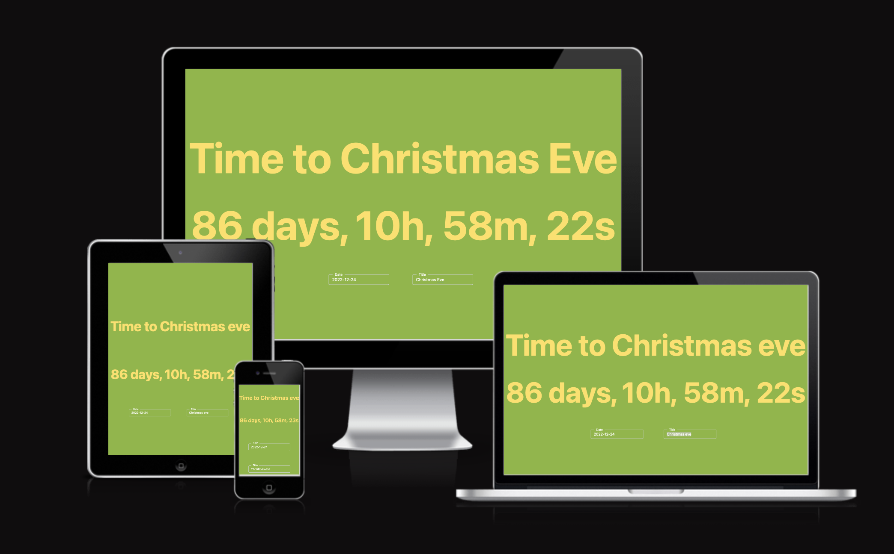

# Countdown app

A Countdown app built in Typescript using the Angular framework, deployed with Netlify. The app allows the user to choose a date and an event and track the countdown towards it.

Live Site: https://ang-ts-countdown.netlify.app



<hr>

## System:
- [Angular CLI](https://angular.io/cli) version 14.2.0 
- Node version v18.8.0
- npm version 8.18.0


## Repo structure:

```

.
├── README.md
└── my-app
    ├── README.md
    ├── angular.json
    ├── karma.conf.js
    ├── package-lock.json
    ├── package.json
    ├── prettier.config.js
    ├── src
    │   ├── app
    │   │   ├── countdown-event.css
    │   │   ├── countdown-event.html
    │   │   ├── countdown-event.module.ts
    │   │   └── countdown-event.ts
    │   ├── environments
    │   │   ├── environment.prod.ts
    │   │   └── environment.ts
    │   ├── favicon.ico
    │   ├── index.html
    │   ├── main.ts
    │   ├── polyfills.ts
    │   ├── styles.css
    │   └── test.ts
    ├── tsconfig.app.json
    ├── tsconfig.json
    └── tsconfig.spec.json

```

## Angular Bootstrap

This project uses [Angular Bootstrap](https://ng-bootstrap.github.io/#/home) version 13.0.0

Installing Angular Bootstrap:

`ng add @ng-bootstrap/ng-bootstrap`

Being able to quickly structure and setup the html [Bootstrap](https://getbootstrap.com/docs/4.5/getting-started/introduction/) version 4.5.3 was used. 


## Fittext

In order to easily make text responsive on all devices with maximum font-size the project uses [ng2-fittext](https://www.npmjs.com/package/ng2-fittext) - an Angular directive written in pure Typescript 

`npm install --save ng2-fittext`

1. Declare it in your module:


```

import {Ng2FittextModule} from "ng2-fittext";
@NgModule({
  imports: [
    Ng2FittextModule
  ]
})

```

2. Using it in your components: 

```

<div [fittext]="true" [activateOnResize]="true" [container]="container">Bla bla bla...</div>

```

## Local Storage

Loss of input data is prevented by using Angular Local Storage. 

## Deployment

1. `Git Push` to Github
2. Create [Netlify Account](https://www.netlify.com/)
3. Connect your Github Account to Netlify, wherein you'll also be able to connect your repository. 
4. Netlify will deploy.
5. Set build dir to `my-app`
6. Set `Build settings` (app-name -> Deploys -> Build settings) in Netlify to `ng build --configuration production`
7. Add `Publishing Path` as `dist/my-app`


## Improvements before being production-ready
- `Tests` (e2e, unit)
- `Reset functionality` to clear the storage
- Use a `Database` to store information instead of Local Storage
- Add an `*ngIf="condition"` no date has been input by user, show an empty div of "0d, 0h, 0m, 0s" for better UI-design.

